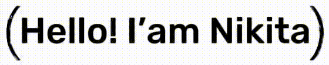

<picture>
  <source media="(prefers-color-scheme: dark)" srcset="greeting_dark.gif">
  <source media="(prefers-color-scheme: light)" srcset="greeting_light.gif">
  
</picture>

## Things I code with

   
  
  
  
   
  
  
  
  

  
  
  
  
  
  
  
  
  
  

<picture>
  <source media="(prefers-color-scheme: dark)" srcset="https://github-readme-stats.vercel.app/api/top-langs/?username=SNikitaSergeevic&hide_progress=false&theme=dark">
  <source media="(prefers-color-scheme: light)" srcset="https://github-readme-stats.vercel.app/api/top-langs/?username=SNikitaSergeevic&hide_progress=false&theme=light">
  
</picture>

<!--  -->

<!--
**SNikitaSergeevic/SNikitaSergeevic** is a ✨ _special_ ✨ repository because its `README.md` (this file) appears on your GitHub profile.

Here are some ideas to get you started:

- 🔭 I’m currently working on

- 🌱 I’m currently learning ...
- 👯 I’m looking to collaborate on ...
- 🤔 I’m looking for help with ...
- 💬 Ask me about ...
- 📫 How to reach me: ...
- 😄 Pronouns: ...
- ⚡ Fun fact: ...
-->
